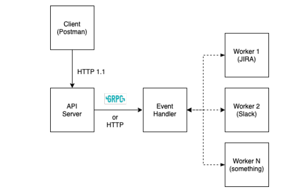

# Squadcast Assignment

# Problem Statement

- Design an application in which there will be an API server which provides CRUD operations for an incident also they can acknowledge, resolve, comment to an incident. 
- Also, 
	- there will be an Event Handler service which will emit appropriate events based on the action taken with the incident. 
   	- there can many worker entities (like JIRA, Slack, Zendesk, etc) which can subscribe to those events.
- If a worker has subscribed to any event (say incident_created), when an incident is created, the Event Handler should receive the event from the API server(producer) and it should emit/sent to all the workers who subscribed to those events.


# Architecture Diagram




# Incident Service

Service for handling and reporting incidents  

* [Deployment](#deployment)
* [Domain](#domain)
* [API](#api)
  * [POST /incident](#post-incident)
  * [GET /incident/`<incident_id>`](#get-incidentincident_id)
  * [PUT /incident/`<incident_id>`](#put-incidentincident_id)
  * [DELETE /incident/`<incident_id>`](#delete-incidentincident_id)
* [Application Directory Structure](#application-directory-structure)
* [Notes](#notes)


## Deployment

### Prerequisites
This has been tested to work in the specified environments.
1. Ubuntu and MacOS
3. Docker Community Edition
4. git

### Running the project locally
1. Run `go build -o main`.
2. Make sure a dockerised instance of `mysql` with relevant environment variables is running. Database environment variables can be matched against that in `application.yaml` file in the project.
3. Run `./main db:migrate:up`
4. Make sure `rabbitmq` is running as well.
5. Open 5 terminals.
6. Run these commands in each of them:
			a. `./main start:eventhandler`
	        b. `./main start:webserver`
	        c. `./main start:worker slack`
	        d. `./main start:worker zendesk`
	        e. `./main start:worker jira`
			
### Building and running using Docker Compose

### Starting
1. Make sure `docker-machine` is installed.
2. Go to `scripts` folder.
3. Run `./deploy.sh` in the terminal.

### Checking the services
1. Run `eval $(docker-machine env node-1)`
2. Run `docker service ls` to view all the services in the virtual machine.

### Logs
1. Run `docker service logs -f <service-id>` to view logs for a service.

### Stopping
1. Run `docker-machine stop node-1` to stop the virtual machine instance.

## Domain

Each incident is uniquely identified by the <b>id</b> given to the incident.  An incident consists of a message, a status, an acknowledgement and comments associated with it.

## API

Internal Server Error is returned in case of database failures or some other app related errors for all the APIs. An example is shown in the POST section.

### POST /incident/

Creates a new incident and inserts it into the db. 

#### Request
```
URL: /incident/
Method: POST
Headers:
Content-Type: application/json
Body: {
    message: "issue with service",
}
```
#### Success Response (200 OK)
```
Content-Type: application/json
Body: {
    status: "INCIDENT CREATED",
	ID: "1"
}
```

#### Failure Response (400 Bad Request)
```
Content-Type: application/json
Body: {
    status: "Bad Request",
	error: <error-description>
}
```

#### Failure Response (500 Internal Server Error)
```
Content-Type: application/json
Body: {
    status: "Internal Server Error",
    error: "incident creation failed"
}
```

### GET /incident/<incident_id>

Gets the incident for the given id.

#### Request
```
URL: /incident/1
Method: GET
```

#### Success Response (200 OK)
**If exists**:
```
Content-Type: application/json
Body: {
    status: "unresolved",
	acknowledged: "no",
	message: "issues with data creation",
	"comments: [
		"working towards resolution"
	]
}
```

**Not Found Response (404 Not Found)**:
```
Content-Type: application/json
Body: {
	status: "Not Found",
	error: "incident not found"
}

```

#### Failure Response (400 Bad Request)
```
Content-Type: application/json
Body: {
    status: "Bad Request",
	error: <error-description>
}
```

### PUT /incident/`<incident_id>`
Update the prefilled metadata of the incident.

#### Request
```
URL: /incident/1
Method: PUT
Body: {
	acknowledged: "yes",
	status: "resolved",
	comments: "this issue was resolved by customer"
}
```

#### Success Response (200 OK)
```
Content-Type: application/json
Body: {
    status: "INCIDENT UPDATED",
}
```

#### Failure Response (400 Bad Request)
```
Content-Type: application/json
Body: {
    status: "Bad Request",
	error: <error-description>
}
```

### DELETE /incident/`<incident_id>`
Delete an incident.


#### Request
```
URL: /incident/1
Method: DELETE
```

#### Success Response (200 OK)
```
Content-Type: application/json
Body: {
    status: "INCIDENT DELETED",
}
```

#### Failure Response (400 Bad Request)
```
Content-Type: application/json
Body: {
    status: "Bad Request",
	error: <error-description>
}
```

## Application Directory Structure

All the code related to the application resides in `internal` directory with the exception of the executable file which resides outside.

#### api
 - this directory contains all the handlers for the `incident` web APIs.

#### config
- `config` has provides data structures and helpers to store app related configurations.

#### eventhandler
- `eventhandler` hosts the `grpc client` - which is used by the `incident web service` to notify the `eventhandler` of an event and the `grpc server` which is used used to notify the `workers` of an event.

#### infrastructure
- this directory hosts the necessary infrastructure for the project like `database` and `queue` and also provides the essential interfaces to be used by the dependent services.

#### migrations 
- `migrations` contains the database migration script to initialize the database schema and functions to migrate the schema to a database.

#### model
- `model` contains application-specific domain objects for view and entities for persistence.

#### serializer
- `serializer` is used by the service and apis to model the information coming from the apis and going out of the apis for the view.

#### service
- `service` interacts with the repository for getting data and updating data before and after processing.

#### repository
- `repository` provides an interface to the service communicate with the database.

#### webserver
- `webserver` hosts the path to the apis and functionalities to start the web server.

#### workers
- `workers` provides functionalities to create and run different types of workers.
 
## Notes

1. Docker images for the internal services have been pushed to Docker Hub with their appropriate configuration.
2. Dependencies like RabbitMQ can be directly pulled from Docker hub while running the services in Docker Swarm.
3. There's some issue in DNS resolution in the case of MySQL because of which  connection is refused by it thereby causing the dependent services to start up.
4. Tests have not been added because of time constraints.
